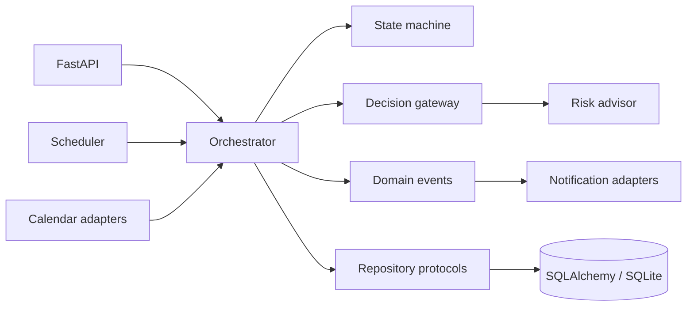

# Jenga

**Predict appointment risk. Recover cancelled capacity.**

Jenga is a backend prototype for appointment-based businesses such as dental
clinics, outpatient practices, salons, and hospitality services. It assigns an
explainable no-show risk score to each booking and responds to cancellations by
finding eligible later appointments that can move into the newly opened slot.

The project explores a practical question: can scheduling software move from
passive calendar management to proactive capacity recovery?

> Jenga is a portfolio and research prototype. Its risk scorer is a
> configuration-driven heuristic, not a clinically validated machine-learning
> model, and it must not be used for medical decisions.

## Why It Exists

Late cancellations create two losses at once: an empty slot today and a risky
appointment still sitting later in the schedule. Jenga models both problems:

1. Score each appointment from behavioral and scheduling signals.
2. Identify high-risk, flexible candidates after a cancellation.
3. Apply consent and urgency rules.
4. Move a candidate or create an earlier-slot offer.
5. continue through the schedule with a bounded cascade.

## Highlights

- Multi-tenant FastAPI API with API-key isolation
- Deterministic, explainable risk scoring from configurable feature weights
- Immutable workflow state machine with guarded transitions
- Bounded cascade orchestration with consent-aware shift offers
- SQLAlchemy persistence behind repository adapters
- Domain events for notifications, auditing, and integrations
- Google Calendar, Calendly, SendGrid, and Twilio adapter foundations
- OpenAPI documentation at `/docs`

## Architecture



The orchestration kernel is cloud-neutral: it owns decisions and state
transitions while adapters handle HTTP, storage, calendars, and notifications.
See [docs/architecture.md](docs/architecture.md) for the design and tradeoffs.

## Risk Model

The scorer combines configurable signals such as:

- client no-show and cancellation history
- day of week and time bucket
- appointment type
- client segment
- lead time
- previous rescheduling

Every weight and threshold lives in `config.yaml`. The current implementation
is intentionally deterministic so a score can be reproduced and explained.
A production model would require representative data, calibration, fairness
analysis, drift monitoring, and human review.

## Quick Start

```bash
python -m venv .venv
# Windows
.venv\Scripts\activate

pip install -e ".[dev]"
copy .env.example .env
uvicorn main:app --reload
```

Open:

- API documentation: <http://127.0.0.1:8000/docs>
- Health check: <http://127.0.0.1:8000/health>

The default configuration uses local SQLite and leaves schedulers and external
integrations disabled.

## Example Flow

Create a tenant:

```bash
curl -X POST http://127.0.0.1:8000/api/v1/businesses \
  -H "Content-Type: application/json" \
  -d "{\"name\":\"Demo Dental Clinic\",\"timezone\":\"Europe/Vienna\"}"
```

Use the returned API key as `X-API-Key` to create clients and appointments.
The interactive OpenAPI page provides schemas and runnable examples for the
remaining endpoints.

## Repository Map

| Path | Purpose |
| --- | --- |
| `main.py` | FastAPI application and HTTP endpoints |
| `jenga/core/` | Orchestration, state, decisions, and domain events |
| `jenga/adapters/` | Persistence, calendar, API, scheduler, and notification adapters |
| `services/` | Legacy service path retained during migration |
| `ml.py` | Configuration-driven risk scorer |
| `config.yaml` | Product rules, thresholds, feature flags, and weights |
| `tests/` | Domain, scoring, and orchestration tests |

## Implementation Status

| Capability | Status |
| --- | --- |
| Tenant, client, and appointment API | Implemented |
| State transition validation | Implemented |
| Explainable heuristic risk scoring | Implemented |
| Cascade candidate selection and bounded moves | Implemented in orchestration kernel |
| Earlier-slot offer domain flow | Prototype |
| Calendar synchronization | Adapter prototype, disabled by default |
| SMS and email delivery | Adapter prototype, credentials required |
| Trained predictive model | Not implemented |
| Production security/compliance controls | Not implemented |

## Tests

```bash
pytest
```

The focused suite verifies state invariants, deterministic risk behavior,
tenant isolation at the orchestration boundary, and cancellation cascades.

## License

MIT
